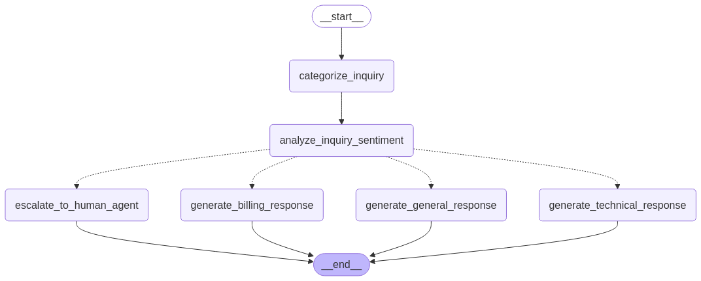

# Agentic-RAG-Driven-Customer-Support-Router

This project focuses on building an **Intelligent Router Agentic RAG System** designed to handle diverse user inquiries effectively by combining intelligent query analysis, sentiment detection, and dynamic routing with **Retrieval-Augmented Generation (RAG)**.  

---

## 🚀 Workflow Overview  
The system includes the following key components:  

### ✅ **1. Query Categorization and Sentiment Analysis**  
- Utilizes **OpenAI GPT-4o** to analyze user queries and determine:  
   - **Query Category** – Identifies the type of issue (e.g., billing, technical, or general).  
   - **User Sentiment** – Assesses the sentiment (positive, neutral, or negative) to decide if escalation is required.  

### ✅ **2. Intelligent Routing**  
Based on the query category and sentiment, the system routes the query to the appropriate handling node:  
- **🔴 Escalate to Human** – If the sentiment is negative, the query is escalated to a human for resolution.  
- **💳 Billing Response** – Routes billing-related queries to generate accurate responses.  
- **⚙️ Technical Response** – Directs technical queries to a specialized handler.  
- **💬 General Response** – Provides context-aware responses for general queries.  

### ✅ **3. Knowledge Base Integration (RAG)**  
- Integrates with a **Vector Database** to enhance responses with accurate and relevant information.  
- **Retrieval-Augmented Generation (RAG)** ensures responses are based on the most reliable and up-to-date data.  

### ✅ **4. Escalation Mechanism**  
- Negative sentiment triggers an automatic escalation to a human agent, ensuring personalized and empathetic support for critical issues.  

---
agentic workflow : 

  
